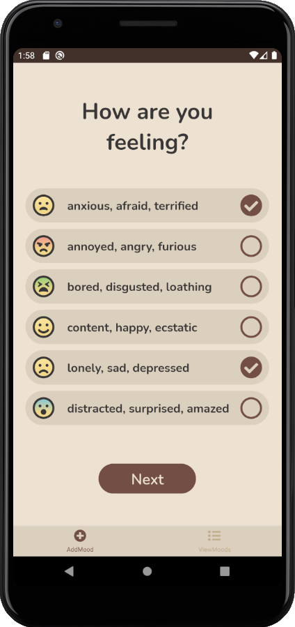
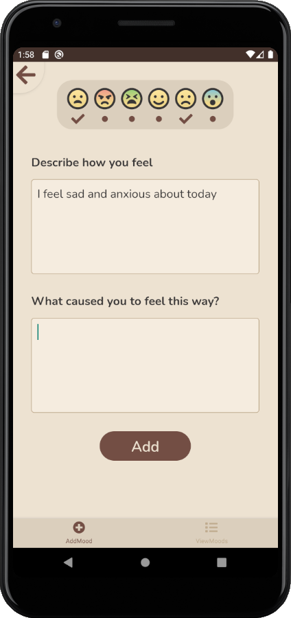
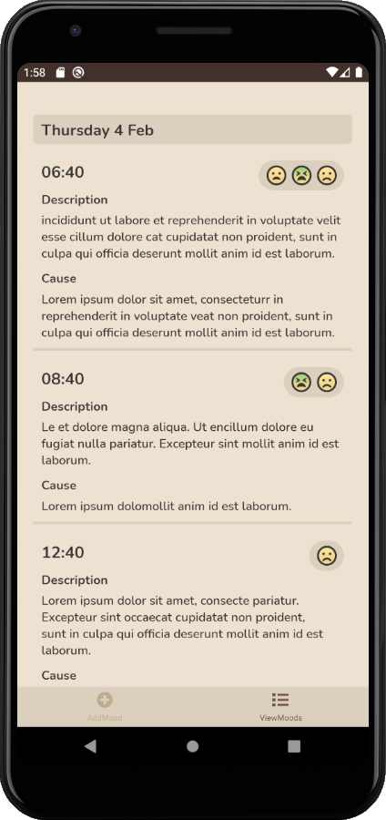

# Emoti
Emoti is a ```React Native``` mood journaling app.

Users can track their mood throughout the day by selecting emotions and providing a description and cause for how they're feeling, empowering them to better understand themselves.

|Add Mood|Add Mood(pg.2)|View Moods|
|---|---|---|
||||
